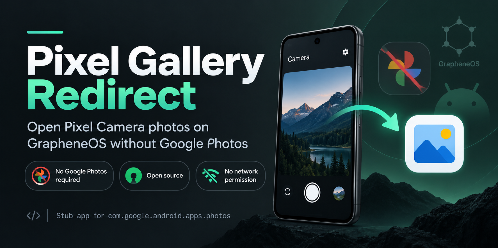
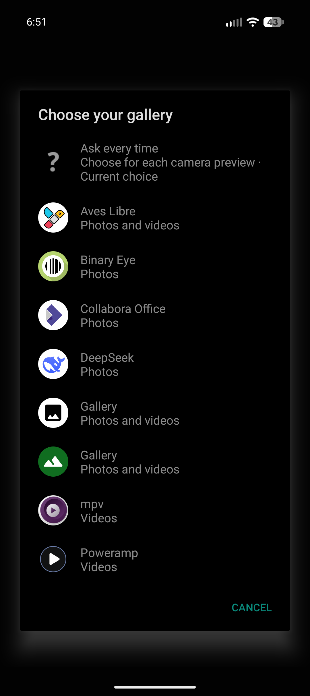
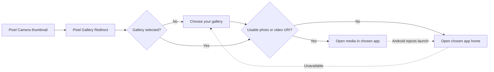
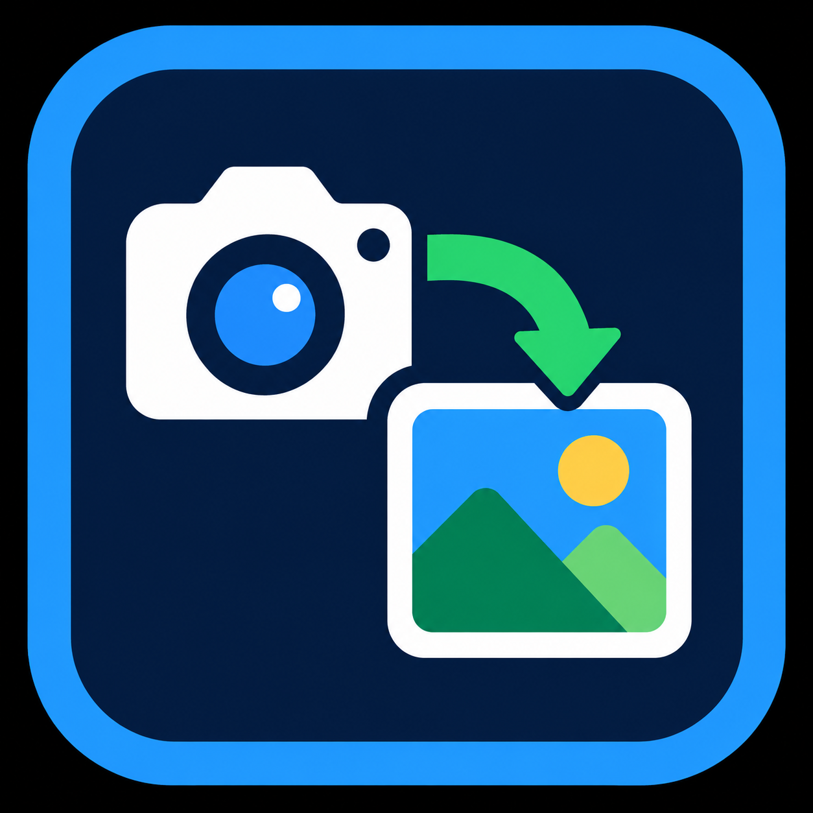

<p align="center">
  
</p>

<h1 align="center">Pixel Gallery Redirect</h1>

<p align="center">
  <strong>Your camera. Your gallery. One tap.</strong><br>
  Make Pixel Camera’s photo thumbnail open your preferred gallery.
</p>

<p align="center">
  <a href="https://github.com/Alex9001/pixel-gallery-redirect/actions/workflows/ci.yml"></a>
  <a href="https://github.com/Alex9001/pixel-gallery-redirect/releases/latest"></a>
  <a href="https://github.com/Alex9001/pixel-gallery-redirect/releases"></a>
  <a href="LICENSE"></a>
  <a href="#compatibility"></a>
</p>

<p align="center">
  <a href="#install">Install</a> ·
  <a href="#f-droid-updates">F-Droid updates</a> ·
  <a href="#how-it-works">How it works</a> ·
  <a href="#build-from-source">Build</a> ·
  <a href="https://github.com/Alex9001/pixel-gallery-redirect/issues">Issues</a>
</p>

<p align="center">
  <a href="https://github.com/Alex9001/pixel-gallery-redirect/releases/latest/download/pixel-gallery-redirect.apk"></a>
  <a href="#f-droid-updates"></a>
  <a href="https://apps.obtainium.imranr.dev/redirect?r=obtainium://app/%7B%22id%22%3A%22com.google.android.apps.photos%22%2C%22url%22%3A%22https%3A%2F%2Fgithub.com%2FAlex9001%2Fpixel-gallery-redirect%22%2C%22author%22%3A%22Alex9001%22%2C%22name%22%3A%22Pixel%20Gallery%20Redirect%22%7D"></a>
  <a href="https://deepwiki.com/Alex9001/pixel-gallery-redirect"></a>
</p>

---

Track official GitHub releases with Obtainium using the button above. Review and
confirm the app configuration in Obtainium. You can also paste
`https://github.com/Alex9001/pixel-gallery-redirect` into its Add App screen.

## Put the thumbnail back to work

You take a photo in Pixel Camera, tap the thumbnail, and get **“Google Photos Required”**
instead of your gallery. Pixel Gallery Redirect is a small, open-source bridge
that receives that request and sends it to the gallery you choose.

<table>
  <tr>
    <th width="50%">Before</th>
    <th width="50%">With Pixel Gallery Redirect</th>
  </tr>
  <tr>
    <td>Tap the photo thumbnail → a prompt to install Google Photos.</td>
    <td>Tap the photo thumbnail → your photo opens in your chosen gallery.</td>
  </tr>
</table>

- **No Google Photos required.** A standalone app with its own code and identity in the launcher.
- **No network permission.** No analytics, cloud connection, ads, or background service.
- **No broad photo-library permission.** Passes the selected content URI with temporary read access.
- **Photos and videos.** Preserves the media type when forwarding to your chosen app.
- **Remember your gallery.** Choose an installed media viewer once; open the app icon to change it.
- **A simple fallback.** Opens the chosen app’s main screen when there is no supported media link or Android rejects the direct launch. If that also fails, the picker lets you choose another app.
- **Unlock first.** Requires unlocking before opening the full gallery.
- **Small and inspectable.** One Java activity, Android platform APIs, and zero third-party runtime libraries.

## Install

<p align="center">
  
</p>

**Want automatic update checks?** Add the [CYBER FRACTURE F-Droid repository](#f-droid-updates)
to install the app and receive future updates through your F-Droid client.
You can also download the APK directly:

1. Download **[pixel-gallery-redirect.apk](https://github.com/Alex9001/pixel-gallery-redirect/releases/latest/download/pixel-gallery-redirect.apk)** from the latest release.
2. Open the APK on your phone and allow installation from your browser or file manager if prompted.
3. Install or enable a gallery, such as **GrapheneOS Gallery**, **Aves**, or **Fossify Gallery**.
4. Open **Pixel Camera**, tap its photo thumbnail, and select an app in **Choose your gallery**.

Future previews open your saved gallery directly. Alternatively, select **Ask every time**
from the app icon’s picker to choose a viewer for each camera preview. Those
one-time selections do not replace Ask every time. Choose a gallery from the app
icon to return to a fixed preference.

Open the **Pixel Gallery Redirect**
app icon whenever you want to change it: selecting an app confirms the choice and
closes the picker. From Camera, selecting an app immediately opens the pending media.
Cancel returns to the caller without changing your previous choice.

The picker shows installed, enabled apps that advertise photo or video viewing,
with icons, supported media categories, and the current choice marked. Compatible
editors and other viewers may appear too. Each package appears once. Advertised
support does not guarantee every format will open.

New installations and upgrades from **v1.0.0** ask you to choose on the next camera
preview; GrapheneOS Gallery is never selected silently. The choice (including Ask every time) is private to
this app in the current Android user profile and does not change Android’s global
defaults. Media requests are held only for the activity lifecycle, never saved in
preferences.

This app uses the package ID Pixel Camera expects: `com.google.android.apps.photos`.
**It cannot be installed alongside Google Photos or another shim using that ID.**
The visible app name is Pixel Gallery Redirect; it contains no Google Photos code.

Prefer USB installation?

```sh
adb install pixel-gallery-redirect.apk
```

For updates from this repository’s releases:

```sh
adb install -r pixel-gallery-redirect.apk
```

Each release includes `SHA256SUMS` and `SIGNING-CERTIFICATE.txt`. After downloading
both the APK and checksum file into the same folder, verify the download with:

```sh
sha256sum -c SHA256SUMS
```

## F-Droid updates

Add the **CYBER FRACTURE** repository once to get Pixel Gallery Redirect updates
through your F-Droid client, without checking GitHub for each release. The same
repository will also carry future CYBER FRACTURE Android apps.

1. Open your F-Droid client's **Settings → Repositories → Add repository**.
2. Paste the repository address below and compare its signing fingerprint with the one listed here.
3. Add the repository, refresh it, and search for **Pixel Gallery Redirect** to install or update it.
4. Enable periodic update checks and update notifications in your client. If your client and Android setup support automatic installation, enable that too; otherwise, approve updates when prompted.

```text
https://alex9001.github.io/cyber-fracture-fdroid/fdroid/repo
```

The [repository setup page](https://alex9001.github.io/cyber-fracture-fdroid/)
also has a copy button that includes the fingerprint. Refresh your repositories
after adding it to load the **CYBER FRACTURE** display name.

Already installed an official APK from GitHub Releases? You can keep it installed:
the repository distributes APKs signed with the same release key, so future
versions can update it in place. Self-built APKs signed with a different key
cannot receive these updates in place.

F-Droid will show the repository signing fingerprint before adding it. Trust it
only if it is:

```text
B3:91:05:30:73:F0:F9:05:59:4C:91:4D:4A:63:C9:D1:CD:B6:73:F0:0D:DE:EE:A5:7C:F7:CF:98:48:0E:10:47
```

The repository is independently hosted rather than in F-Droid's main catalogue
because this app uses the Google Photos package ID required by Pixel Camera.

## Permissions and access

**You do not need to approve a permission prompt to use the redirect.** Here is
the access it uses and the permission control you may see on GrapheneOS:

| Access or setting | Why it appears / what it does | What you need to allow |
|---|---|---|
| **Sensors** in GrapheneOS app settings | GrapheneOS adds this permission and enables it by default for compatibility, unless you changed that default. The redirect does not call sensor APIs. | You can turn Sensors off for the redirect; sensor access is not required for gallery selection or forwarding. |
| **Temporary access to the preview photo/video** | Camera supplies a content URI with temporary read access. The redirect passes that access to your selected viewer. | No separate permission prompt from the redirect. This is access to the supplied media, not your whole library. |
| **Discovery of installed viewers** | Scoped queries find apps that handle photo/video viewing, so the picker can list them. | No permission prompt. |

The Sensors setting is added by GrapheneOS even though the APK declares no
`uses-permission` entries. Seeing it enabled does not mean the app requested or
used sensors. See [GrapheneOS's Sensors permission documentation](https://grapheneos.org/features#sensors-permission-toggle).

Your chosen gallery and your update client have their own permissions, managed
separately from the redirect.

The gallery preference is stored in private app storage. Media URIs are not saved
there. CI checks both the source manifest and packaged APK for declared permissions.

## How it works



Pixel Camera directs photo-review intents to the Google Photos package.
The redirect registers that package and its compatible activity name,
`pager.HostPhotoPagerActivity`, then creates a fresh `ACTION_VIEW` intent for
the saved package. It resolves the appropriate activity for each photo or video.
Camera-specific extras and task flags are not forwarded.
The app grants temporary read access to the selected URI and never requests
storage or media-library permissions.

The supplied artwork is used directly as the APK’s launcher icon:

<p align="center">
  
</p>

## Compatibility

| Item | Support |
|---|---|
| Gallery discovery | Installed apps advertising `ACTION_VIEW` for content-based images or videos |
| Minimum OS | Android 10 / API 29 |
| Build target | Android 16 / API 36 |
| Initial device | Pixel 9a with GrapheneOS, API 37 |
| Initial Pixel Camera version | `10.4.117.936816638.14` |
| Examples | GrapheneOS Gallery, Aves Libre, Fossify Gallery; see [validation](VALIDATION.md) for tested versions |
| Root | Not required |

Build, signature, installation, and selection/routing regression tests were checked
on the Pixel 9a. See [validation notes](VALIDATION.md) for the exact device checks
and remaining compatibility limitations.

Gallery controls viewing, editing, and format support. Google Photos-specific
features such as cloud backup, its editor, and its processing integrations are
not implemented. Photos still being saved may not be immediately viewable.
Future Pixel Camera updates could change its integration contract.

This is an independent project, not affiliated with Google or GrapheneOS.

## Troubleshooting

| Symptom | Try this |
|---|---|
| Android refuses to install | Check for Google Photos or another app using the same package ID. A differently signed build also requires uninstalling the previous redirect first. |
| “Google Photos Required” still appears | Install the redirect in the same Android user profile as Pixel Camera, then close and reopen Camera. |
| Gallery does not open | Open the redirect’s app icon and choose an installed, enabled gallery. If the saved app was removed or disabled, Camera shows the picker again. |
| No apps in the picker | Install or enable an app that supports viewing photos or videos in this Android user profile. |
| The gallery opens its main screen | The supplied media is missing, unsupported, or its launch was rejected. Finish any first-run setup in the gallery and try again. |
| Asked to choose after upgrading | This is expected once when upgrading from v1.0.0. |
| A viewer is listed that is not a gallery | It advertises compatible viewing intents; choose the gallery you prefer. |
| A just-taken photo does not open | Wait for Pixel Camera to finish processing, then tap the thumbnail again. |
| Asked to unlock | Unlock the device before opening the gallery. |

To remove it, uninstall **Pixel Gallery Redirect** in Android Settings, or run:

```sh
adb uninstall com.google.android.apps.photos
```

Removing the redirect does not delete your photos or Gallery.

## Build from source

Requires Linux, Python 3.9+, and a JDK (21+ recommended). The build uses the
official Android SDK directly; there is no Gradle or Android Studio requirement.

```sh
git clone https://github.com/Alex9001/pixel-gallery-redirect.git
cd pixel-gallery-redirect
python3 setup-sdk.py
python3 build.py
```

`setup-sdk.py` downloads pinned Android SDK 36 components from Google over HTTPS
and checks their published archive checksums. Tools live in
`~/.cache/pixel-gallery-android`; build output stays in `build/` and the final
APK is `pixel-gallery-redirect.apk`.

| Environment variable | Purpose |
|---|---|
| `BUILD_JAVA_HOME` | Select a JDK; otherwise use a valid `JAVA_HOME` or Java on `PATH` |
| `ANDROID_JAR` | Use an existing platform `android.jar` |
| `ANDROID_BUILD_TOOLS` | Use an existing SDK build-tools directory |

The build compiles the supplied icon into Android resources, compiles Java to
DEX, aligns the APK, signs it, and verifies its signature and alignment.
It generates a local key under `.signing/` on the first build. **Keep that directory
private and backed up** to sign updates to your own builds. It is ignored by Git.
Self-built APKs use your key and cannot update the official release in place.

CI builds and verifies the app with a temporary key. Public release APKs are
signed separately with the maintainer’s retained key; that key is not stored in
the repository or CI.

## Reproducible builds

The build supports **byte-for-byte reproducible unsigned APKs** with the same
source and toolchain. ZIP entry order, timestamps, permissions, and storage method
are fixed. CI builds in two different paths with different input timestamps and
timezones and compares SHA-256 hashes.

```sh
python3 setup-sdk.py
python3 build.py --unsigned
cd build
sha256sum -c UNSIGNED-SHA256SUMS
```

The output is `build/pixel-gallery-redirect-unsigned.apk`; this mode does not read
or create signing keys. `build/BUILD-INFO.json` records the compiler/Python versions,
SDK tool hashes, and unsigned APK hash. Use the same JDK version and the pinned
SDK components from `setup-sdk.py` when comparing builds.

Run the independent-build comparison from the repository root:

```sh
python3 tests/reproducible.py
```

Unsigned APKs cannot be installed. `python3 build.py` additionally signs the APK
with your local key. A separately signed APK has a different checksum; compare
unsigned hashes, not signed APK hashes from different keys. See
[release preparation](RELEASE.md) for publishing the unsigned checksum and build
information with future releases. This support applies to builds made with this
updated script; it does not retroactively make the existing v1.1.0 release reproducible.

## Tests and releases

```sh
python3 tests/run.py          # compile the platform-only test APK after building
python3 tests/run.py --device # install and test on one connected, unlocked Android device
```

The device tests temporarily use a fixture viewer and test preferences, restore the
previous choice, and uninstall the fixture. CI runs them on an Android 10 emulator
and keeps the signature, alignment, permission, and artwork checks. No test library
is included in the production APK. See [release preparation](RELEASE.md) for the
retained-key GitHub release process.

## Contributing

Bug reports and focused fixes are welcome. Include your device, Android,
Pixel Camera, and Gallery versions, plus steps to reproduce. Please keep private
photos and media URIs out of public reports.

See [contributing](.github/CONTRIBUTING.md), [changelog](CHANGELOG.md), and
[validation](VALIDATION.md).

The compatibility approach was checked against
[google-pixel-camera-redirect](https://github.com/nermolov/google-pixel-camera-redirect)
and [GPhotosShim](https://github.com/CaramelFur/GPhotosShim). This implementation
was written independently using Android platform APIs.

## License

[ISC](LICENSE) © 2026 Aleksandr Oreshkin.
