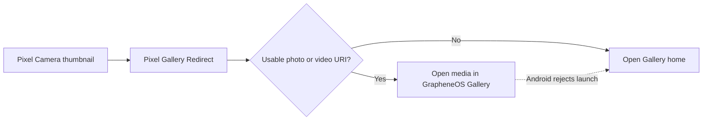

<p align="center">
  
</p>

<h1 align="center">Pixel Gallery Redirect</h1>

<p align="center">
  <strong>Your camera. Your gallery. One tap.</strong><br>
  Make Pixel Camera’s photo thumbnail open GrapheneOS Gallery.
</p>

<p align="center">
  <a href="https://github.com/Alex9001/pixel-gallery-redirect/actions/workflows/ci.yml"></a>
  <a href="https://github.com/Alex9001/pixel-gallery-redirect/releases/latest"></a>
  <a href="https://github.com/Alex9001/pixel-gallery-redirect/releases"></a>
  <a href="LICENSE"></a>
  <a href="#compatibility"></a>
</p>

<p align="center">
  <a href="https://github.com/Alex9001/pixel-gallery-redirect/releases/latest/download/pixel-gallery-redirect.apk"><strong>Download APK</strong></a> ·
  <a href="#install">Install</a> ·
  <a href="#how-it-works">How it works</a> ·
  <a href="#build-from-source">Build</a> ·
  <a href="https://github.com/Alex9001/pixel-gallery-redirect/issues">Issues</a>
</p>

---

## Put the thumbnail back to work

You take a photo in Pixel Camera, tap the thumbnail, and get **“Photos required”**
instead of your gallery. Pixel Gallery Redirect is a small, open-source bridge
that receives that request and sends it to GrapheneOS’s built-in Gallery.

<table>
  <tr>
    <th width="50%">Before</th>
    <th width="50%">With Pixel Gallery Redirect</th>
  </tr>
  <tr>
    <td>Tap the photo thumbnail → a prompt to install Google Photos.</td>
    <td>Tap the photo thumbnail → your photo opens in GrapheneOS Gallery.</td>
  </tr>
</table>

- **No Google Photos required.** A standalone app with its own code and identity in the launcher.
- **No network permission.** No analytics, cloud connection, ads, or background service.
- **No broad photo-library permission.** Passes the selected content URI with temporary read access.
- **Photos and videos.** Preserves the media type when forwarding to Gallery.
- **A simple fallback.** Opens Gallery home when there is no supported media link or Android rejects the direct launch.
- **Unlock first.** Requires unlocking before opening the full gallery.
- **Small and inspectable.** One Java activity, Android platform APIs, and zero third-party runtime libraries.

## Install

1. Download **[pixel-gallery-redirect.apk](https://github.com/Alex9001/pixel-gallery-redirect/releases/latest/download/pixel-gallery-redirect.apk)** from the latest release.
2. Open the APK on your phone and allow installation from your browser or file manager if prompted.
3. Keep GrapheneOS’s built-in **Gallery** enabled.
4. Open **Pixel Camera** and tap its photo thumbnail.

There is no setup screen. The **Pixel Gallery Redirect** app icon opens Gallery too.

This app uses the package ID Pixel Camera expects: `com.google.android.apps.photos`.
**It cannot be installed alongside Google Photos or another shim using that ID.**
The visible app name is Pixel Gallery Redirect; it contains no Google Photos code.

Prefer USB installation?

```sh
adb install pixel-gallery-redirect.apk
```

For updates from this repository’s releases:

```sh
adb install -r pixel-gallery-redirect.apk
```

Each release includes `SHA256SUMS` and `SIGNING-CERTIFICATE.txt`. After downloading
both the APK and checksum file into the same folder, verify the download with:

```sh
sha256sum -c SHA256SUMS
```

## How it works



Pixel Camera directs photo-review intents to the Google Photos package.
The redirect registers that package and its compatible activity name,
`pager.HostPhotoPagerActivity`, then creates a fresh `ACTION_VIEW` intent for
`com.android.gallery3d`. Camera-specific extras and task flags are not forwarded.
The app grants temporary read access to the selected URI and never requests
storage or media-library permissions.

The supplied artwork is used directly as the APK’s launcher icon:

<p align="center">
  
</p>

## Compatibility

| Item | Support |
|---|---|
| Gallery | GrapheneOS built-in Gallery (`com.android.gallery3d`) |
| Minimum OS | Android 10 / API 29 |
| Build target | Android 16 / API 36 |
| Initial device | Pixel 9a with GrapheneOS, API 37 |
| Initial Pixel Camera version | `10.4.117.936816638.14` |
| Other gallery apps | Not currently configurable |
| Root | Not required |

Build, signature, installation, and intent resolution were checked on the initial
device. Full thumbnail, video, processing, and back-navigation checks are still
pending; see [validation notes](VALIDATION.md) for the exact scope.

Gallery controls viewing, editing, and format support. Google Photos-specific
features such as cloud backup, its editor, and its processing integrations are
not implemented. Photos still being saved may not be immediately viewable.
Future Pixel Camera updates could change its integration contract.

This is an independent project, not affiliated with Google or GrapheneOS.

## Troubleshooting

| Symptom | Try this |
|---|---|
| Android refuses to install | Check for Google Photos or another app using the same package ID. A differently signed build also requires uninstalling the previous redirect first. |
| “Photos required” still appears | Install the redirect in the same Android user profile as Pixel Camera, then close and reopen Camera. |
| Gallery does not open | Enable GrapheneOS’s built-in Gallery. Other gallery apps are not selected automatically. |
| A just-taken photo does not open | Wait for Pixel Camera to finish processing, then tap the thumbnail again. |
| Asked to unlock | Unlock the device before opening the gallery. |

To remove it, uninstall **Pixel Gallery Redirect** in Android Settings, or run:

```sh
adb uninstall com.google.android.apps.photos
```

Removing the redirect does not delete your photos or Gallery.

## Build from source

Requires Linux, Python 3.9+, and a JDK (21+ recommended). The build uses the
official Android SDK directly; there is no Gradle or Android Studio requirement.

```sh
git clone https://github.com/Alex9001/pixel-gallery-redirect.git
cd pixel-gallery-redirect
python3 setup-sdk.py
python3 build.py
```

`setup-sdk.py` downloads pinned Android SDK 36 components from Google over HTTPS
and checks their published archive checksums. Tools live in
`~/.cache/pixel-gallery-android`; build output stays in `build/` and the final
APK is `pixel-gallery-redirect.apk`.

| Environment variable | Purpose |
|---|---|
| `BUILD_JAVA_HOME` | Select a JDK; otherwise use a valid `JAVA_HOME` or Java on `PATH` |
| `ANDROID_JAR` | Use an existing platform `android.jar` |
| `ANDROID_BUILD_TOOLS` | Use an existing SDK build-tools directory |

The build compiles the supplied icon into Android resources, compiles Java to
DEX, aligns the APK, signs it, and verifies its signature and alignment.
It generates a local key under `.signing/` on the first build. **Keep that directory
private and backed up** to sign updates to your own builds. It is ignored by Git.
Self-built APKs use your key and cannot update the official release in place.

CI builds and verifies the app with a temporary key. Public release APKs are
signed separately with the maintainer’s retained key; that key is not stored in
the repository or CI.

## Contributing

Bug reports and focused fixes are welcome. Include your device, Android,
Pixel Camera, and Gallery versions, plus steps to reproduce. Please keep private
photos and media URIs out of public reports.

See [contributing](.github/CONTRIBUTING.md), [changelog](CHANGELOG.md), and
[validation](VALIDATION.md).

The compatibility approach was checked against
[google-pixel-camera-redirect](https://github.com/nermolov/google-pixel-camera-redirect)
and [GPhotosShim](https://github.com/CaramelFur/GPhotosShim). This implementation
was written independently using Android platform APIs.

## License

[ISC](LICENSE) © 2026 Aleksandr Oreshkin.
